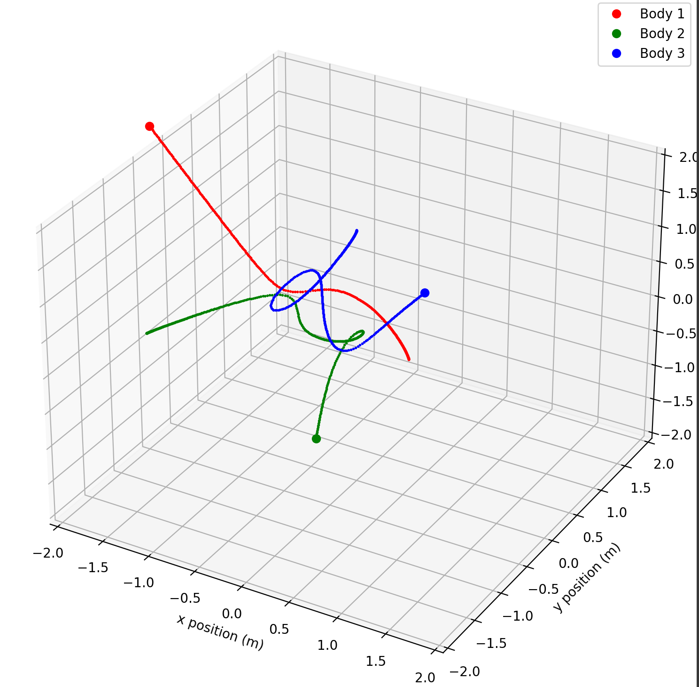

## A Three-Body-Problem solver and visualizer

Define your initial conditions with the Python Tkinter GUI, hit run, and watch the chaos!  

## Using this program

The intended entry point is the Launcher.py file. Run it from the root directory of this repository.  
This file will launch the GUI with a pre-defined set of initial conditions. 

Of course, you can also edit the initial conditions to your liking, and can save interesting configurations to an .ini file.

## Implementation

The simulation core is written in C++, and makes use of the Runge-Kutta-Fehlberg solver.
See more information here: https://en.wikipedia.org/wiki/Runge%E2%80%93Kutta%E2%80%93Fehlberg_method

And: https://en.wikipedia.org/wiki/Three-body_problem
